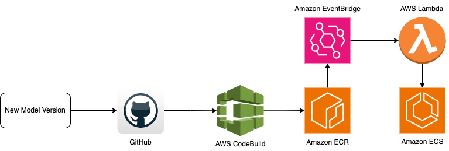

# Approach to automatically update ML model deployment without SageMaker

Simple overview of use/purpose.

## Description
This content serves as an exercise to explore an alternative route, presenting a rudimentary approach to automated machine model deployment devoid of Amazon SageMaker. 
In this demonstration, we employ the pre-trained YOLOv8 model as our baseline, subsequently refining it through transfer learning and ultimately deploy for inference to illustrate the automated workflow pipeline. 
This guide will focus on an example Docker container image featuring fundamental inference capabilities, which can automatically redeploy to reflect changes whenever there's a model update.

## Prerequisites
- Ultralytics
- Python (version >= 3.11)

### Architecture

### Getting Started

1. Set up your virtual environment (only necessary if there is a need to build new solution)
2. Clone Gitlab repo.
3. Deploy the solution.

